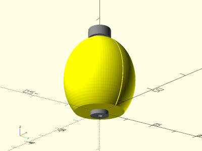

# Parametric Slotted Float

<table>
<tr>
<td></td>
<td></td>
</tr>
<tr>
<td></td>
<td></td>
</tr>
<tr>
<td></td>
<td></td>
</tr>
<tr>
<td></td>
</tr>
</table>

A parametric slotted float that can be used in both fixed and slip float configurations. Float is printed with TPU, using multiple perimeters for water tightness and low infill for buoyancy. Peg is printed with PLA+ or PETG. Made with OpenSCAD.

**Parameters:**

* `float_diameter` - diameter of float, default 20mm
* `float_length` - length of float, default 22.5mm
* `float_slot_width` - line slot width, default 0.2mm, can be reduced (e.g. 0.1) for filaments with less expansion
* `peg_clearance` - clearance in peg bore, default 0mm, can be increased (e.g 0.25) for less flexible filaments
* `peg_diameter` - diameter of peg, default 5mm
* `peg_base_height` - height of peg base, default 3mm

**Design:** [slotted_float.scad](slotted_float.scad)

**STLs:**

* [float_20x22.5mm.stl](stl/float_20x22.5mm.stl)
* [peg_22.5mm.stl](stl/peg_22.5mm.stl)

**Recommended Print Settings:**

* Float - Flexible TPU, 0.20mm layer height, 5% rectilinear infill, 4 top and 4 bottom horizontal layers, 3 perimeters, no supports (see slicer image above for internal visualization)
* Peg - PLA+ or PETG, 0.20mm layer height, 100% infill, no supports

**Thingiverse:** TBD

**License**: 
